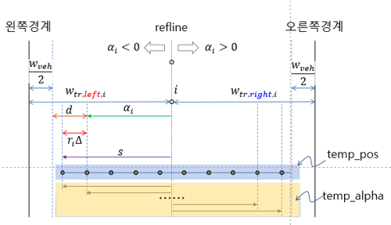

# gen_node_skeleton

## INPUT
centerline, track width, raceline에 기반하여 graph structure를 위한 node 뼈대 생성하는 함수
여러 노드의 위치와 heading(각도)를 생성한다.
```python
def gen_node_skeleton(graph_base: graph_ltpl.data_objects.GraphBase.GraphBase,
                      length_raceline: list,
                      var_heading=True,
                      closed: bool = True) -> list:
``` 
- INPUT 
  - `graph_base`
  - `length_raceline` = `lenth_rl` global raceline에서 샘플링된 vertex들의 구간별 s 길이
  - variable_heading : offline.ini에 기본 True로 저장되어 있다.

## 트랙 폐쇄 여부에 따라 idx 지정
```python
    if closed:
        closed_idx = None
    else:
        closed_idx = -1
```
- closed는 기본적으로 True값을 갖는다.
- 트랙이 폐쇄형이면 전체 데이터를 사용하고, 아니라면 마지막 원소는 제외한 구간만 사용한다.

## graph_base로부터 기본 정보 추출
```python
    normvec_normalized = graph_base.normvec_normalized
    alpha = graph_base.alpha
    track_width_right = graph_base.track_width_right
    track_width_left = graph_base.track_width_left
```
- graph_base에서 normal 벡터, alpha, 좌/우 트랙 폭 정보를 가져온다.

## raceline 좌표 계산
```python
    raceline_points = graph_base.refline + normvec_normalized * alpha[:, np.newaxis]
```
- centerline으로부터 alpha만큼 떨어진 위치가 raceline points이다.

## raceline에서의 heading 계산
```python
    psi = tph.calc_head_curv_num.calc_head_curv_num(path=raceline_points,
                                                    el_lengths=np.array(length_raceline[:closed_idx]),
                                                    is_closed=closed)[0]
```
- <span style="color:orange">global raceline의 psi를 쓰지 않는다는 점? 굳이 왜 다시 heading을 계산하는가.</span>
  
**[tph.calc_head_curv_num](tph.calc_head_curv_num.md)**

## track 좌/우 경계선 및 heading 계산.
```python
    psi_bound_l = None
    psi_bound_r = None
    if var_heading:
        bound_r = graph_base.refline + normvec_normalized * np.expand_dims(track_width_right, 1)
        bound_l = graph_base.refline - normvec_normalized * np.expand_dims(track_width_left, 1)

        d = np.diff(np.vstack((bound_l, bound_l[0])), axis=0)
        len_bl = np.hypot(d[:, 0], d[:, 1])

        d = np.diff(np.vstack((bound_r, bound_r[0])), axis=0)
        len_br = np.hypot(d[:, 0], d[:, 1])

        psi_bound_l = tph.calc_head_curv_num.calc_head_curv_num(path=bound_l,
                                                                el_lengths=np.array(len_bl[:closed_idx]),
                                                                is_closed=closed)[0]

        psi_bound_r = tph.calc_head_curv_num.calc_head_curv_num(path=bound_r,
                                                                el_lengths=np.array(len_br[:closed_idx]),
                                                                is_closed=closed)[0]
```
- <span style="color:orange">set_track_data()와 동일하다.
  
## 차량이 track 폭 내에 들어오는지 체크
```python
    state_pos = []
    raceline_index_array = []

    margin_left = min(track_width_left - graph_base.veh_width / 2 + alpha)
    margin_right = min(track_width_right - graph_base.veh_width / 2 - alpha)
    if (margin_left < 0.0) or (margin_right < 0.0):
        max_veh_width = graph_base.veh_width + min(margin_left, margin_right) * 2
```
- 만약 차량이 track 내에 들어오지 못하면 print로 에러메시지 나타냄.(여기서는 생략했음)

## 각 centerline point마다 수행
```python
    for i in range(len(normvec_normalized)):
        raceline_index = int(np.floor((track_width_left[i] - graph_base.veh_width / 2 + alpha[i])
                                      / graph_base.lat_resolution))
        s = alpha[i] - raceline_index * graph_base.lat_resolution
        temp_alphas = np.arange(s, track_width_right[i] - graph_base.veh_width / 2, graph_base.lat_resolution)
        temp_pos = np.repeat(graph_base.refline[i][None, :], len(temp_alphas), axis=0) + \
                   np.repeat(normvec_normalized[i][None, :], len(temp_alphas), axis=0) * temp_alphas[:, np.newaxis]
```
- `raceline_index` 계산: width_lef에서 차량 폭/2와 alpha를 반영해 lateral로 몇 개의 sample을 둘지 계산
- `s`: 샘플링 시작점 offset 계산
- `temp_alphas`: 왼쪽 경계~오른쪽 경계까지 일정 간격(lat_resolution)으로 샘플링
- `temp_pos`: 각 포인트의 실제 좌표 계산 / centerline에서 alpha만큼 normal vector방향으로 이동하여 계산한다. 



## 각 노드의 heading 설정
```python
        if var_heading:
            if abs(psi_bound_l[i] - psi[i]) < np.pi:
                psi1 = np.linspace(psi_bound_l[i], psi[i], num=raceline_index + 1)[:-1]
            else:
                temp_bl = psi_bound_l[i] + 2 * np.pi * (psi_bound_l[i] < 0)
                temp_psi = psi[i] + 2 * np.pi * (psi[i] < 0)
                psi1 = tph.normalize_psi.normalize_psi(np.linspace(temp_bl, temp_psi, num=raceline_index + 1)[:-1])
            if abs(psi_bound_r[i] - psi[i]) < np.pi:
                psi2 = np.linspace(psi[i], psi_bound_r[i], num=len(temp_alphas) - raceline_index)
            else:
                temp_br = psi_bound_r[i] + 2 * np.pi * (psi_bound_r[i] < 0)
                temp_psi = psi[i] + 2 * np.pi * (psi[i] < 0)
                psi2 = tph.normalize_psi.normalize_psi(np.linspace(temp_psi, temp_br, num=len(temp_alphas) - raceline_index))
            temp_psi = np.append(psi1, psi2)
        else:
            temp_psi = np.repeat(psi[i], len(temp_alphas), axis=0)
```
- 선형보간으로 하여 각 노드에서의 heading을 조정한다. 2*pi를 기준으로 wrap-around 처리

## node 정보 저장
```python
        # store info in local variable
        list.append(state_pos, [temp_pos, temp_psi])

        # store node information in data object
        graph_base.add_layer(layer=i,
                             pos_multi=temp_pos,
                             psi=temp_psi,
                             raceline_index=raceline_index)
```
- 각 포인트별로 [좌표, heading] 쌍을 `state_pos`에 저장
- graph_base 객체에도 node 정보를 저장한다. 

**[graph_base.add_layer](graph_base.md)**

## return값 
```python
    graph_base.raceline_index = raceline_index_array
    return state_pos
```
- 모든 노드 정보(`state_pos`)를 return한다. 